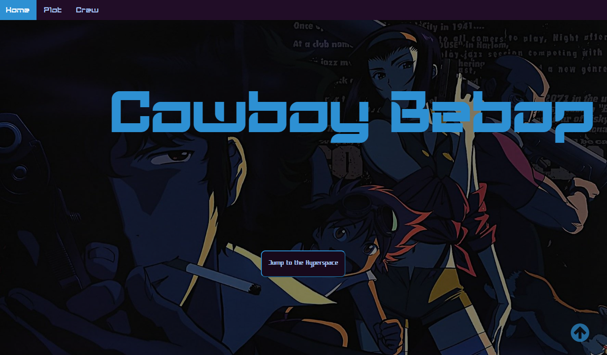

<h1>Proyecto fin de evaluación de Lenguajes de Marcas de 1º DAW</h1>
<h2>Cyberpunk</h2>
<h2>Indice</h2>

<ul>
  <li><a href="#introduccion">Introducción</a></li>
  <li><a href="#motivacion">Motivación</a></li>
  <li><a href="#estructura">Estructura</a></li>
  <li><a href="#estilo">Estilo</a></li>
</ul>

<h2 id="introduccion">Introducción</h2>

Trabajo realizado en clase por: Manuel Alarcón For

Proyecto de web "from scratch" de 1ª evaluación de Lenguajes de Marcas

Diciembre de 2023 

Licencia CC-BY

<h2 id="motivacion">Motivación</h2>

He decidido hacer esta página web sobre el género Cyberpunk y sobre obras célebres relacionadas con este ya que es un tema que me atrae por su relación con el retrofuturismo, lo cual me parece muy interesante por las formas en la que la gente puede ver el futuro, ya sea utópico o distópico.

<h2 id="estructura">Estructura</h2>

La web está dividida en  7 subpáginas:

<ol>
  <li>La pagina principal</li>  
  <li>Orígenes del género</li>
  <li>Características del mismo</li>
  <li>Neuromante</li>
  <li>Cyberpunk 2077</li>
  <li>Cowboy Bebop</li>
  <li>Blade Runner</li>
</ul>

<h3>Página inicial</h3>

He utilizado una imagen de fondo tomada de Getty Wallpaper (http://m.gettywallpapers.com/cyberpunk-4k-wallpapers/) que se adapta fácilmente a diferentes dispositivos.En esta misma pagina tengo otras secciones que daran lugar a las demás subpáginas: ¿Qué es el cyberpunk?, Origenes, Caraterísticas, Ejemplos en los medios (Neuromante, Cyberpunk 2077, Cowboy Bebop y Blade Runner), así como una galería de las imagenes usadas. Sobre ella he colocado un Call to Action que he estilado a partir de un button estilizado para ir acorde a la estética de la página.

<h3>Orígenes del género y Características</h3>
  

Estas paginas similares estan compuestas por un accordion, dividiendo las páginas en dos secciones

<h3>Neuromante</h3>

He utilizado una imagen de fondo tomada de Getty Wallpaper (https://williamgibsonbooks.com) que se adapta fácilmente a diferentes dispositivos. Sobre ella he colocado un Call to Action que he estilado a partir de un button estilizado para ir acorde a la estética de la página. Se divide en las secciones de William Gibson, su autor, y de los otros libros de la trilogía.

<h3>Cyberpunk 2077</h3>

He utilizado una imagen de fondo tomada de alphacoders (https://wall.alphacoders.com/tag/4k-cyberpunk-wallpapers) que se adapta fácilmente a diferentes dispositivos. Sobre ella he colocado un Call to Action que he estilado a partir de un button estilizado para ir acorde a la estética de la página. Se divide en las secciones de la linea temporal y de los distintos productos de la franquicia.

<h3>Cowboy Bebop</h3>

He utilizado una imagen de fondo tomada de wallhere (https://wallhere.com/es/wallpaper/2254022) que se adapta fácilmente a diferentes dispositivos. Sobre ella he colocado un Call to Action que he estilado a partir de un button estilizado para ir acorde a la estética de la página. Se divide en las secciones de la trama y de los miembros de la tribulación.

<h3>Blade Runner</h3>

He utilizado una imagen de fondo tomada de xtrafondos (https://www.xtrafondos.com/wallpaper/3840x2400/3957-blade-runner-2049.html) que se adapta fácilmente a diferentes dispositivos. Sobre ella he colocado un Call to Action que he estilado a partir de un button estilizado para ir acorde a la estética de la página. Se divide en las secciones de Blade Runn y de los miembros de la tribulación.

<h2 id="estilo">Estilo de la página</h2>
<h3>Paleta de colores</h3>

Dependerá de la página, pero principalmente son #A8C4F5 (texto) y #17091B (fondo). Dependiendo de la subpágina, el color de resalte será: #F942DD (principal, origin y características), #F74E73 (Neuromante), #2D90D3 (Cowboy Bebop), #906495 (Blade Runner) y #f3e600 (Cyberpunk 2077)

<h3>Tipografías</h3>

Son dos tipografías unicamente: KogniGear (títulos) y SpaceJunkXL (texto), ambas sacadas de 1001 fonts.

<h3>Imágenes</h3>

Todos los background patterns son de la página haikei: https://app.haikei.app

<h4>Página inicial</h4>

El favicon lo he sacado de Freepik: https://www.freepik.com/icon/cyberpunk_4769970

La foto de la sección de introducción es de Pinterest: https://www.pinterest.es/pin/180495897552614245/?amp_client_id=CLIENT_ID%28_%29&mweb_unauth_id=&simplified=true

La foto de la sección de origenes es de Pinterest: https://ar.pinterest.com/pin/738731145149924343/

La foto de la sección características es de la página oficial de Cyberpunk 2077: https://www.cyberpunk.net/es/en/cyberpunk-2077

<h4>Origenes</h4>

La foto de la sección de origenes es de Mubi, una página de películas: https://mubi.com/es/es/films/akira

La foto de la sección del retrofuturismo es de Pinterest: https://www.pinterest.es/pin/413627547035562692/

<h4>Características</h4>

La foto de la sección de Macrocorporaciónes es de Reddit: https://www.reddit.com/r/CitiesSkylines/comments/kussyq/arasaka_tower/

La foto de la sección de origenes es de UHDpaper: https://www.uhdpaper.com/2020/09/8669-cyberpunk-2077-spine-exoskeleton-4k.html

<h4>Neuromancer</h4>

La foto de la sección de William Gibson es de La Vanguardia: https://www.lavanguardia.com/peliculas-series/personas/william-gibson-150783

El resto de fotos de los libros son de la página oficial de William Gibson: https://williamgibsonbooks.com

<h4>Cyberpunk 2077</h4>

La foto de la sección de la linea temporal es de la página del fandom de Cyberpunk 2077: https://cyberpunk.fandom.com/wiki/Timeline

El resto de fotos de las cards son de: -Juegos de Mesa:https://williamgibsonbooks.com

                                       -Videojuegos   :https://es.wallpapers.com/fondos-de-pantalla/fotode-retrato-en-cyberpunk-2077-para-android-utmix59jtm9wug8t.html

                                       -Libros        :https://www.jokercomics.es/libro/cyberpunk-2077-wheres-johny_117162

                                       -Anime         :https://www.reddit.com/r/Dominican/comments/xegsrv/primer_personaje_de_anime_dominicano/

<h4>Cowboy Bebop</h4>

La foto de la sección de la card de la página principal es de Pinterest: https://www.pinterest.es/pin/365987907224252707/s

La foto de la sección del argumento es de la página de Artstation: https://www.artstation.com/artwork/ZaJK4R

Las fotos de la tripulación son de: -Spike Spiegel: https://www.pinterest.com.mx/pin/613334043025405526/

                                    -Jet Black: https://www.amazon.es/Cowboy-Bebop-Reino-Unido-DVD/dp/B000BBOUMW

                                    -Faye Valentine: https://www.reddit.com/r/cowboybebop/comments/1723c8q/faye_valentine_wallpaper_oc/

                                    -Ed and Ein:https://www.reddit.com/r/cowboybebop/comments/rcgz96/bebop_art_card_scans_from_the_new_limited_edition/

<h4>Blade Runner</h4>

La foto de la sección de Blade Runner es de la página de National Geographic: https://historia.nationalgeographic.com.es/a/philip-k-dick-maestro-mundos-alternativos_15958

La foto de la sección de Blade Runner 2049 es de la página de Floxer: https://www.flooxernow.com/noticias/blade-runner-2049-pelicula-imperfecta-pero-esta-altura-original_2017100359d7008e0cf29f7c62da7984.html

<h3>Audios</h3>

Sonido de los botones: https://pixabay.com/es/sound-effects/search/electric%20bip/

Tema pricipal de Cyberpunk 2077: https://youtu.be/mhehxYhXG5Q?si=1JMI_lVRoFnORQrl

Tema pricipal de Cyberpunk Edgerunners: https://youtu.be/OifiVCnFKzM?si=I6tPae3yRTHqK4cl

<h2 id="snippets">Code snippets</h2>

He utilizado los siguientes:

<ul>
  <li>Barra de navegación: tomada de w3Schools: https://www.w3schools.com/howto/howto_js_topnav_responsive.asp</li>
  <li>Accordion: tomado de FreeFrontend: https://freefrontend.com/css-accordions/</li>
  <li>Modal: tomado de w3Schools: https://www.w3schools.com/howto/howto_css_modals.asp</li>
  <li>Cards: tomada de w3Schools: https://www.w3schools.com/howto/howto_css_cards.asp</li>
  <li>Galeria: tomada de w3Schools: https://www.w3schools.com/howto/howto_css_image_grid_responsive.asp</li>
  <li>Efecto de Galeria: tomada de CodePen: https://codepen.io/nxworld/pen/ZYNOBZ</li>
</ul>